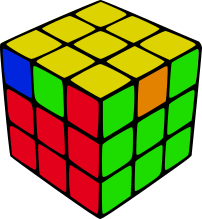
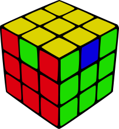
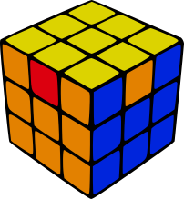
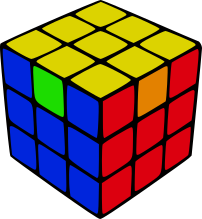
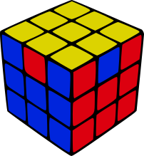

# Extras
## PASSO 4 - Segunda camada.
### Algoritimo 1

Para facilitar em vez de repetir um algorítimo duas vezes podemos usar o seguinte algorítimo

formula: **(R U2 R' U)2 F' U' F**

[Exemplo em video (1:28)](https://youtu.be/3ozKDPk6oAw?list=PLN0OEk4xKN9TEo8F-EADFqb-U9xWTNc2H&t=88)
 
## PASSO 5 Cruz amarela.
### CASO L

Em vez de que transformar no caso linha ja vamos direto para a cruz amarela Com essa formula 

formula: **F U R U' R' F'**

## PASSO 7 Finalizar as quinas.
### Algorítimo 1

maneira mais fácil de deixar todas as faces com as quinas iguais 
O primeiro passo e deixar uma face com a quina ja formada para trás
[|Exemplo em video (3:13)|](https://youtu.be/CrOB6mSECjI?list=PLN0OEk4xKN9TEo8F-EADFqb-U9xWTNc2H&t=193)
 
X = Mover o cubo inteiro na mesma rotação de movimento r

Formula: X (R' U R') D2 (R U' R') D2 R2

## PASSO 8 Finalizar os meios.
### Minerva UA

quando vc tem que mover a peça central para direita
[|Exemplo em video (7:12)|](https://youtu.be/3ozKDPk6oAw?list=PLN0OEk4xKN9TEo8F-EADFqb-U9xWTNc2H&t=432)

formula: **(R U' R U)(R U R U')(R' U' R2)**

Para deixar nesse Caso: R2 U R U R' U' R' U' R' U R'
### Minerva UB

quando vc tem que mover a peça central para esquerda
[|Exemplo em video (9:49)|](https://youtu.be/3ozKDPk6oAw?list=PLN0OEk4xKN9TEo8F-EADFqb-U9xWTNc2H&t=589)

formula: **(R2 U R U)(R' U' R' U')(R' U R')**

Para deixar nesse Caso: R U' R U R U R U' R' U' R2

### Caso H

quando as peças do meio sao das cores invertidas da cor central
[|Exemplo em video (10:36)|](https://youtu.be/CrOB6mSECjI?list=PLN0OEk4xKN9TEo8F-EADFqb-U9xWTNc2H&t=636)

M = rotação da camada do meio nesse caso so sera usada com duas rotações

formula: **(M2' U M2') U2 (M2' U M2')**

Para deixar nesse Caso: So repeti o caso dele mesmo'

### Caso Z

quando as peças do meio sao das cores do lado da cor central

A cubo deve esta posicionado com frente a peça central tem que ir para a direita     
[|Exemplo em video (12:47)|](https://youtu.be/CrOB6mSECjI?list=PLN0OEk4xKN9TEo8F-EADFqb-U9xWTNc2H&t=767)

M = rotação da camada do meio nesse caso so sera usada com duas rotações

formula: **(M2' U M2' U)(M' U2)(M2' U2 M') depois alinhar o topo**

Para deixar nesse Caso: So repeti o caso dele mesmo'